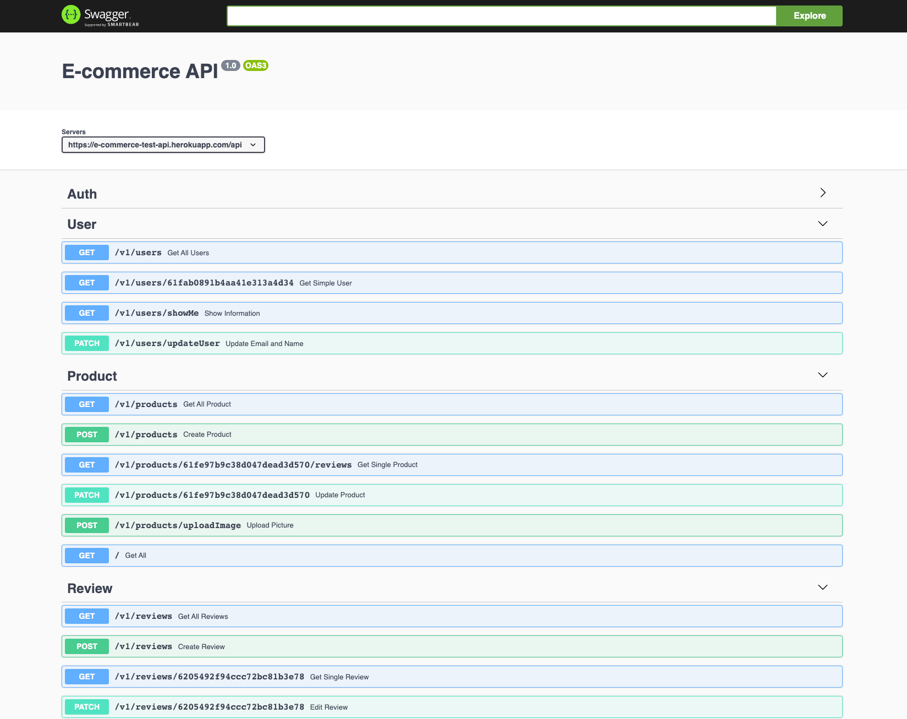

# E-commerce API
Simple E-Commerce API with Node.js, Express, MongoDB and Mongoose ODM

# Screenshot


[Live Demo Link](e-commerce-test-api.herokuapp.com/)

# Tools & Technologies Used
- Node.js
- MongoDB and Mongoose
- Express
- Stripe API for payments
- JSON Web Tokens
- Postman
- Swagger UI


## Installation And Usage

To run this project run

```bash
  git clone https://github.com/defmian/e-commerce-api.git
```
Go to directory
```bash
  cd E-Commerce API
```
Install all dependecies
```bash
 npm install
```
Run Project
```bash
  npm start
```

Create and fill .env file with the following variables

```bash
MONGODB_URL=
JWT_SECRET=
JWT_LIFETIME=
```